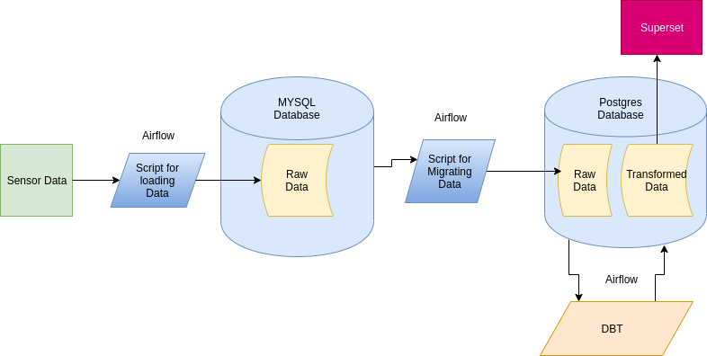

# Project: Migrate to Postgres and Superset from MYSQL and Redash



This project builds a scalable and robust **data warehouse** tech-stack that will help to provide an AI service to a client. The [Data](https://anson.ucdavis.edu/~clarkf/) used for this project is sensor data in csv format. In [Data (ucdavis.edu)](https://anson.ucdavis.edu/~clarkf/) you can find parquet data, and or sensor data in CSV. **ELT pipeline** was developed by migrating an ELT pipeline that was developed using MYSQL, DBT and Airflow for orchestrating the tasks. This was done by changing the the MySQL data warehouse to Postgres and the Redash dashboard to Superset.

# Table of Contents
- [Project: Migrate to Postgres and Superset from MYSQL and Redash](#project-migrate-to-postgres-and-superset-from-mysql-and-redash)
- [Table of Contents](#table-of-contents)
- [Project Structure](#project-structure)
- [ELT Pipeline](#elt-pipeline)
  - [migrate.py](#migratepy)
  - [redash_dag.py](#redash_dagpy)
  - [Built With](#built-with)
- [License](#license)

# Project Structure

```
airflow_postgres
|__dags
  |___postgres
    |____create_station_Summary.sql    # exported queries
    |____insert_station_summary.sql    # exported queries
  |___src
    |____mysql_converter.py            # A script which convert mysql queries into postgres
    |____redash_export.py              # export redash queries
  |___migrate.py                       # ELT pipeline for migrating data to postgres
  |___redash_dag.py                    # ELT pipeline for exporting queries to superset  
DBT
|___models
  |____merged_station.sql            # sql file for transforming tables
```


# ELT Pipeline
## migrate.py
ELT pipeline builder

1. `Get_table name`
	* reads table name from mysql database
2. `Migrate`
	* Migrate sql statement from mysql to postgres
## redash_dag.py
Extract and export queries to superset

## Built With

* [MYSQL](https://www.mysql.com/)
* [Postgres](https://www.postgresql.org/)
* [Apache Airflow](https://airflow.apache.org/)
* [dbt](https://www.getdbt.com/)
* [Redash](https://redash.io/)
* [Superset](https://superset.apache.org/)


# License
[MIT](https://github.com/nebasam/Migration-to-postgres-and-superset)

